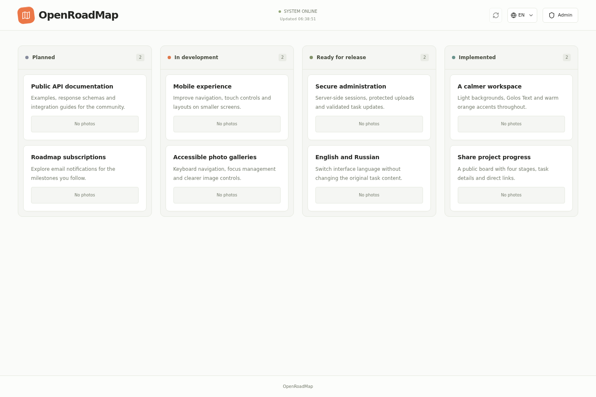
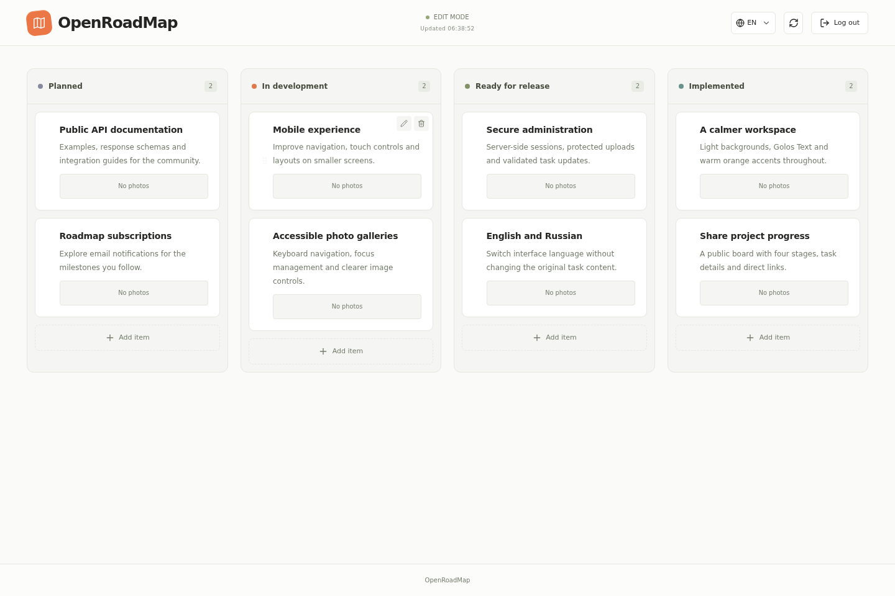

# OpenRoadMap

**Публичная дорожная карта проекта с защищённой админкой для собственного сервера.**

Показывайте, что вы планируете, разрабатываете и выпускаете. OpenRoadMap объединяет Kanban-доску с четырьмя этапами, карточки задач, фотогалереи и drag-and-drop управление в приложении на React и Node.js.

[English](README.md) · [Безопасность](SECURITY.md) · [Результаты аудита](docs/AUDIT.md)

## Как это выглядит

### Публичная дорожная карта



### Панель администратора



*Реальные скриншоты приложения с демонстрационными тестовыми данными. Примеры карточек описывают вымышленный проект, а не перечень реализованных возможностей OpenRoadMap.*

## Возможности

- **Публичный просмотр и контролируемое редактирование:** посетителям не нужен аккаунт; изменения задач и загрузки защищены серверной сессией.
- **Четыре этапа:** В планах → В разработке → Готово ждёт релиз → Реализовано.
- **Управление задачами:** создание, редактирование, удаление и перетаскивание между колонками. На сенсорных устройствах этап можно сменить в форме редактирования.
- **Фотогалереи:** загрузка JPEG, PNG, GIF и WebP, просмотр в модальном окне и прямая ссылка на задачу.
- **Русский и английский интерфейс:** определение языка браузера, переключатель и сохранение предпочтения.
- **Перевод RU → EN по запросу:** показывается рядом с оригиналом и не изменяет запись в базе.
- **Светлый адаптивный дизайн:** Golos Text, тёплые оранжевые акценты, выделение фокуса и поддержка уменьшенной анимации.
- **Выбор базы данных:** SQLite для простой установки с одним процессом, PostgreSQL для серверного размещения.

Адреса: `/` — публичная доска; `/admin` — управление; `/item/:id` — страница задачи.

## Быстрый старт

Понадобятся **Node.js 22.12+**, **npm** и Git. Внешняя база данных для локального запуска не нужна.

```bash
git clone https://github.com/JustForEducate/Open-RoadMap.git
cd Open-RoadMap
npm run setup
npm run admin:setup
npm run dev
```

Откройте **http://localhost:5173**. Backend работает на **http://localhost:3001**.

`admin:setup` создаёт уникальный пароль администратора, один раз выводит его в терминал и записывает только **scrypt-хеш** в `backend/.env`. Сохраните пароль в менеджере паролей. **Пароля по умолчанию нет.** Без настроенного хеша публичный просмотр доступен, но вход администратора отключён.

Если нужны дополнительные настройки, скопируйте `backend/.env.example` в `backend/.env` **до** выполнения `admin:setup`. Не перезаписывайте созданный `.env` шаблоном после генерации пароля.

Остановка обоих dev-серверов — **Ctrl+C**. В Windows `START.bat` запускает ту же команду; `STOP.bat` объясняет безопасную остановку и не завершает чужие процессы Node.js.

## Команды

Выполняются из корня репозитория:

| Команда | Назначение |
|---|---|
| `npm run setup` | Установка корневых, backend- и frontend-зависимостей по lock-файлам |
| `npm run admin:setup` | Генерация пароля администратора и сохранение хеша |
| `npm run dev` | Запуск обоих dev-серверов |
| `npm run dev:backend` / `npm run dev:frontend` | Запуск одного dev-сервера |
| `npm start` | Запуск API без режима наблюдения |
| `npm run build` | Сборка frontend в `frontend/dist` |
| `npm run lint` | Статические проверки JavaScript/JSX |
| `npm test` | Тесты backend/API и frontend-утилит |
| `npm run check` | Линтер, тесты и production-сборка |
| `npm run test:e2e` | Браузерные тесты Chromium с изолированной базой |

Перед первым запуском браузерных тестов:

```bash
npx playwright install --with-deps chromium
npm run test:e2e
```

Браузерные тесты используют порты **3002/5174**, временную базу и отдельные тестовые учётные данные. Обычная дорожная карта не заполняется демоданными. Переменная `UPDATE_SCREENSHOTS=1` при запуске тестов обновляет изображения для README.

## Настройка

Backend читает `backend/.env` независимо от рабочей директории. Frontend использует `frontend/.env`; его переменные видны браузеру и не должны содержать секреты.

### Backend

| Переменная | По умолчанию / назначение |
|---|---|
| `ADMIN_PASSWORD_HASH` | Не задана; генерируется через `npm run admin:setup` |
| `PORT` / `HOST` | `3001` / `0.0.0.0` |
| `DATABASE_URL` | Не задана — SQLite; URL PostgreSQL переключает приложение на PostgreSQL |
| `SQLITE_PATH` | `../database.sqlite` относительно `backend/` либо абсолютный путь |
| `UPLOADS_DIR` | `uploads` относительно `backend/` либо абсолютный путь |
| `NODE_ENV` | Для HTTPS-развёртывания задайте `production`: включает Secure-cookie |
| `ALLOWED_ORIGINS` | Точные origin frontend через запятую. Локально: `http://localhost:5173,http://127.0.0.1:5173`. В production дополнительные origin по умолчанию отсутствуют; same-origin запросы разрешены |
| `COOKIE_SAME_SITE` | `lax`; `none` требует production/HTTPS и нужен только для cross-site размещения |
| `TRUST_PROXY` | `0`; задавайте точное число доверенных reverse-proxy переходов только при необходимости |

### Frontend

| Переменная | По умолчанию / назначение |
|---|---|
| `VITE_API_BASE_URL` | Пусто — same-origin `/api` и `/uploads`; иначе origin backend без `/api` |
| `VITE_APP_FOOTER` | `OpenRoadMap` |
| `VITE_DEV_PORT` | `5173` |
| `VITE_DEV_PROXY_TARGET` | `http://localhost:3001` |

После изменения конфигурации перезапустите серверы. Изменение production-переменных `VITE_*` требует повторной сборки frontend.

## Развёртывание и данные

**Рекомендуемый вариант:** раздавайте `frontend/dist` по HTTPS и проксируйте `/api` и `/uploads` на один backend-процесс с того же origin. Так не возникают ограничения сторонних cookie. SPA-fallback на `index.html` должен применяться к frontend-маршрутам, но не к API.

**Render + Vercel:**

1. Создайте Render Web Service: корень `backend`, сборка `npm ci`, запуск `npm start`.
2. Задайте `NODE_ENV=production`, `ADMIN_PASSWORD_HASH` и точный origin frontend в `ALLOWED_ORIGINS`. Настройте `TRUST_PROXY` согласно реальной схеме проксирования.
3. При необходимости создайте PostgreSQL и укажите `DATABASE_URL`.
4. Подключите постоянное хранилище для `UPLOADS_DIR`. PostgreSQL содержит метаданные фото, **но не файлы изображений**.
5. Разверните Vercel: корень `frontend`, пресет Vite, `VITE_API_BASE_URL` — HTTPS-origin backend. SPA-маршруты настроены в `frontend/vercel.json`.
6. Разные домены Vercel/Render требуют `COOKIE_SAME_SITE=none`; некоторые браузеры всё равно блокируют сторонние cookie. Предпочтительнее same-origin прокси или собственные same-site домены.

Резервируйте базу **и** фотографии. Родительский каталог SQLite должен существовать. Изменение `DATABASE_URL` не переносит данные между движками. `backend/server.js` сохранён как совместимая точка запуска.

Сессии и лимиты запросов хранятся в памяти процесса. Сессия действует **8 часов** или до перезапуска backend; выход отзывает её на сервере. Эта версия рассчитана на **один backend-процесс**. Несколько реплик требуют общего хранилища сессий и лимитов, общего хранилища изображений и подходящей стратегии работы с БД.

## Безопасность и ограничения

- Пароль и права на изменения проверяются сервером, а не `localStorage`.
- Cookie сессии — HttpOnly, в production — Secure. Изменяющие запросы требуют заголовок `X-Requested-With: OpenRoadMap`; origin браузера проверяется.
- Вход: **10 попыток за 15 минут на IP**. API: **300 запросов в минуту на IP**. Перевод: **10 запросов в минуту на IP**, не более четырёх переводов одновременно на процесс.
- Заголовок: **200 символов**; описание: **10 000 символов**; этап: целое число **1–4**. JSON-тело ограничено **32 КиБ**.
- Загрузка: одно изображение, **10 МиБ**, до **25 мегапикселей**. Файл декодируется, очищается от метаданных, уменьшается до 2560×2560 и сохраняется как WebP. Анимация превращается в неподвижный кадр.
- Перевод: 1–2 непустые строки, суммарно до 10 200 символов; серверный таймаут 15 секунд. Текст передаётся внешнему сервису **MyMemory** только по запросу перевода.
- Некорректный JSON и нарушенная схема ответа показывают явную ошибку вместо пустого «успешного» результата. Таймаут клиента охватывает заголовки **и тело ответа**, отмена запроса очищает обработчики.

Эти меры не заменяют безопасный хостинг, обновление зависимостей и резервное копирование. Подробнее: [SECURITY.md](SECURITY.md), [область аудита и оставшиеся ограничения](docs/AUDIT.md).

## API

| Метод | Endpoint | Доступ |
|---|---|---|
| `GET` | `/api/health` | Публичный |
| `GET` | `/api/items` | Публичный список с фото |
| `GET` | `/api/items/:id` | Задача с фото; 404, если не найдена |
| `POST` | `/api/items` | Администратор; `{title, description?, stage}` |
| `PUT` / `DELETE` | `/api/items/:id` | Администратор |
| `GET` | `/api/items/:id/photos` | Публичный |
| `POST` | `/api/items/:id/photos` | Администратор; multipart-поле `photo` |
| `DELETE` | `/api/items/:id/photos/:photoId` | Администратор |
| `POST` | `/api/translate` | Публичный, с лимитами; `{texts, from: "ru", to: "en"}` |
| `GET` | `/api/auth/session` | Состояние сессии |
| `POST` | `/api/auth/login` | `{password}`; выдаёт cookie сессии |
| `POST` | `/api/auth/logout` | Отзывает текущую сессию |

Сторонний клиент должен отправлять указанный заголовок для изменений, сохранять cookie после входа и задавать JSON `Content-Type` для JSON-тел. URL фото в ответах API — относительные пути `/uploads/...`; разрешайте их относительно origin backend.

## Структура проекта

```text
backend/src/        Express, запуск, конфигурация, БД, маршруты,
                    репозитории, валидация, безопасность и сервисы
backend/test/       Интеграционные API- и unit-тесты
frontend/src/app/   Точка входа, роутер и глобальные стили
frontend/src/features/admin/     Вход и оболочка админки
frontend/src/features/roadmap/   Доска, карточки, галереи и перевод
frontend/src/shared/             HTTP-клиент, i18n, контексты, hooks и UI
frontend/test/      Тесты клиента и локализации
tests/e2e/          Браузерные сценарии и генерация скриншотов
scripts/            Dev-запуск, настройка пароля, изолированный E2E-сервер
docs/               Скриншоты и отчёт аудита
```

**Стек:** React 18, Vite 7, React Router 7, Lucide, Express 4, Multer 2, Sharp, SQLite (`sql.js`) / PostgreSQL (`pg`). Оформление — обычный CSS, без Tailwind. Golos Text загружается с Google Fonts; при недоступности остаются системные шрифты.

## Решение проблем

- **Вход отключён:** выполните `npm run admin:setup` и перезапустите backend.
- **403 / Origin not allowed:** проверьте точный origin frontend в `ALLOWED_ORIGINS`, включая протокол и порт.
- **После успешного входа снова показывается форма:** проверьте cookie, HTTPS, конфигурацию прокси и блокировку сторонних cookie.
- **Нет связи с API / некорректный ответ:** проверьте `/api/health`, `VITE_API_BASE_URL` и маршруты прокси. HTML от SPA-fallback не является ответом API.
- **Пропали фото после деплоя:** проверьте постоянное хранение и резервирование `UPLOADS_DIR`.
- **Не работает перевод:** проверьте исходящий HTTPS и доступность MyMemory; ошибка не меняет оригинал задачи.

## Участие в разработке

Делайте небольшие целевые изменения, добавляйте регрессионные тесты и запускайте `npm run check` и затронутые браузерные сценарии. Не коммитьте пароли, локальные базы и загрузки. UI-строки добавляйте в оба словаря RU/EN. Для багов указывайте шаги воспроизведения, окружение и очищенные от секретов логи; не публикуйте детали уязвимостей открыто.
